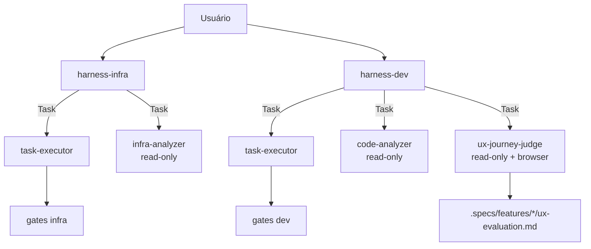
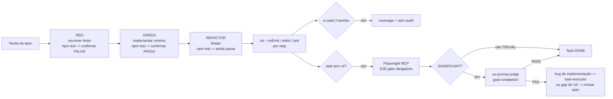
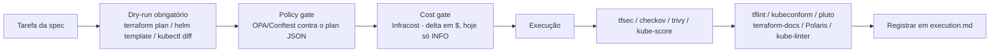
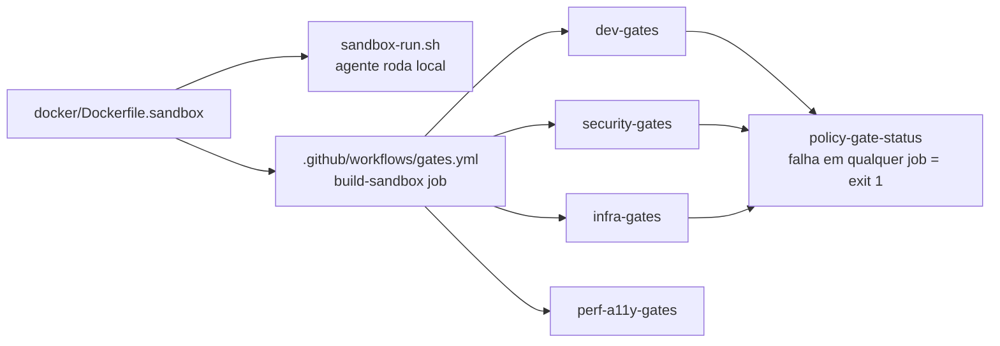

# Harness — Visão Geral de Agentes, Skills e Fluxos

Documento de apresentação. Retrata o estado do repo `agents-harness` em 2026-09-04 (branch `main`, formato Claude Code — `codex/` é espelho equivalente para OpenAI Codex).

---

## 1. O que é

Sistema de agentes de IA **spec-driven** para infraestrutura e desenvolvimento. Princípio central:

```
SPEC → APPROVE → EXECUTE (com gates) → VERIFY (ferramentas externas) → REGISTER (audit + metrics)
```

Nada executa sem spec. Nada passa sem verificação externa (o agente nunca se autovalida). Nada é esquecido — audit trail e métricas são obrigatórios em toda ação que muda estado.

---

## 2. Agentes

### 2.1 Orquestradores (topo da cadeia, acionados pelo usuário)

| Agente | Domínio | Tools | Pode delegar? |
|---|---|---|---|
| **harness-infra** | Terraform, Kubernetes, AWS/cloud, Helm, Docker | Read, Write, Edit, Bash, Glob, Grep, WebSearch, WebFetch, **Task** | Sim → task-executor, infra-analyzer |
| **harness-dev** | TypeScript/Node.js, TDD, Clean Architecture | Read, Write, Edit, Bash, Glob, Grep, WebSearch, WebFetch, **Task** | Sim → task-executor, code-analyzer, ux-journey-judge |

Regra de ambos: **orquestrador planeja e coordena, nunca implementa diretamente** (harness-dev proíbe explicitamente execução direta de tarefa — regra 6, "MANDATORY delegation via sub-agent").

### 2.2 Sub-agentes (delegados, escopo fechado)

| Sub-agente | Papel | Tools | Pode modificar? |
|---|---|---|---|
| **task-executor** | Implementa 1 tarefa por vez, TDD quando aplicável | Read, Write, Edit, Bash, Glob, Grep | Sim, só dentro do escopo da tarefa recebida |
| **infra-analyzer** | Mapeamento brownfield, drift detection, scan de segurança IaC, análise de custo | Read, Bash, Glob, Grep | **Não — read-only, forçado no tool scope** |
| **code-analyzer** | Mapeamento de código, auditoria de dependências, qualidade/cobertura | Read, Bash, Glob, Grep | **Não — read-only** |
| **ux-journey-judge** | Avaliador independente de usabilidade (goal-completion) | Read, Write, Bash + só ferramentas Playwright | Não modifica implementação (sem Edit por design); só escreve seu próprio relatório |

**Isolamento proposital do `ux-journey-judge`**: nunca recebe rota, seletor, nome de componente ou o "Happy Path" da spec — só ator, objetivo, estado inicial e critérios de sucesso. Evita que o avaliador "saiba demais" e valide a implementação em vez da experiência real.

### 2.3 Diagrama de delegação



---

## 3. Fluxo principal (harness flow) — toda ação que muda estado

```mermaid
flowchart LR
    A[SPEC criada e aprovada] --> B[ANTES da tarefa\nSTATE.md -> IN_PROGRESS]
    B --> C[DURANTE\ndry-run obrigatório\nterraform plan / helm template / kubectl diff\nTDD Red->Green->Refactor quando dev]
    C --> D[Checkpoint a cada 3 passos\nou 15min, o que vier primeiro]
    D --> E[DEPOIS\nrodar gates externos]
    E -->|PASS| F[Registrar em .specs/audit/execution.md\nSTATE.md -> DONE]
    E -->|FAIL| G[Analisar -> corrigir -> re-rodar gate\nmax 3 (infra) / 5 (dev) retries]
    G -->|esgotou retries| H[ESCALAR para humano\nSTATE.md -> PAUSED]
    F --> I[Ao final: re-rodar TODOS os gates\nmétricas + resumo\nSTATE.md -> COMPLETED/PARTIAL]
```

### 3.1 Gate flow interno (harness-gates skill)

```
REQUEST → PRE-GATES → DRY-RUN → APPROVAL → EXECUTE → POST-GATES → REGISTER
```

**Pre-gates**: spec válida? viola policy hard? dry-run passa? blast radius (LOW ≤3 reversível / MEDIUM 4-10 / HIGH >10 ou irreversível → aprovação humana)? custo estimado? plano de rollback documentado?

**Post-gates**: verificação com ferramenta externa + registro em audit/STATE/metrics.

### 3.2 Circuit breaker (feedback-loop skill)

| Condição | Ação |
|---|---|
| 3 passos consecutivos falharam | STOP |
| Retries globais > limite do spec | STOP |
| Tempo total > timeout do spec | STOP |
| Custo estimado > limite do spec | STOP |
| >50% dos passos falharam | STOP |

Ao acionar: checkpoint final, motivo registrado em audit, resumo gerado, `STATE.md` → `PAUSED — circuit breaker: [motivo]`.

---

## 4. Fluxo dev (harness-dev) — TDD obrigatório



Se teste passa sem código novo → teste está errado, reescrever. Nunca criar código e teste juntos em lote.

---

## 5. Fluxo infra (harness-infra) — dry-run + gates externos



---

## 6. Fluxo UI completo — 3 gates independentes que nunca se substituem

| Gate | Pergunta que responde | Skill/agente |
|---|---|---|
| **interface-design** | O componente usa os tokens certos? | `interface-design` (lê/escreve `.interface-design/system.md`) |
| **playwright-mcp** | A interface funciona tecnicamente (E2E)? | `playwright-mcp` — browser real, TDD Red obrigatório antes de implementar |
| **ux-journey** | Um usuário que nunca viu a implementação consegue atingir o objetivo sozinho? | `ux-journey-judge` — só para mudanças **SIGNIFICANT** |
| **harness-judge** | A qualidade geral da execução foi boa? | LLM-as-judge, roda depois, nunca antes |

```
classify (TRIVIAL|SIGNIFICANT) → [SIGNIFICANT] journey.md aprovado junto da spec
  → TDD Red → implementar → Playwright PASS → extract-journey-brief (remove Happy Path)
  → ux-journey-judge (Task, sem rota/seletor/nome de arquivo) → PASS obrigatório → DONE
```

`goal_completion < 1.0` ou qualquer hard failure = FAIL, mesmo com score agregado alto. Hard failures: objetivo não completado, dead end, erro sem recuperação, ação destrutiva sem confirmação, sucesso não perceptível, erro bloqueante sem explicação, exigiu conhecimento fora da UI, CTA não descobrível no orçamento de fricção.

---

## 7. Skills — inventário completo por categoria

### 7.1 Núcleo do harness (fluxo, estado, auditoria)

| Skill | Função |
|---|---|
| `harness-gates` | Checkpoints obrigatórios pre/durante/pós ação; políticas hard (`policies.md`); regras de escalação |
| `feedback-loop` | Ciclo execute→verify→correct autônomo; circuit breaker; checkpoints |
| `spec-manager` | Scripts para criar/gerenciar `.specs/` (init-project, create-spec, update-state, create-retrospec, create-journey, extract-journey-brief) |
| `audit-trail` | Registro append-only de toda ação que muda estado |
| `audit-writer` | Scripts que efetivamente escrevem em `execution.md`/metrics (log-task, log-summary, log-metrics, log-ux-result) |
| `metrics-collector` | Métricas de execução (duração, steps, retries, gates, escalations) em `.specs/metrics/` |
| `harness-judge` | LLM-as-judge pós-execução — avalia correctness/security/blast-radius (infra) ou correctness/quality/tests/TDD (dev); nunca o próprio agente se autoavalia |
| `auto-retry` | Resume sessão `autonomous` após rate-limit da assinatura (tmux + polling); força `--remote-control` |

### 7.2 Gates de qualidade — desenvolvimento

| Skill | Ferramentas | Quando roda |
|---|---|---|
| `code-gates` | tsc, eslint, jest (per-step) · coverage, npm audit (checkpoint/3 tarefas) · sonar-scan (final) · dependency-cruiser (arquitetura) · jscpd + sonarjs (duplicação/complexidade) · Stryker (mutação, final only) |

### 7.3 Gates de segurança

| Skill | Ferramentas | Quando roda |
|---|---|---|
| `security-gates` | gitleaks, trivy fs, osv-scanner (fast/per-task) · semgrep, trivy config, syft+grype/SBOM (final) · kube-bench (manual, só cluster real) |

### 7.4 Gates de qualidade infra

| Skill | Ferramentas | Quando roda |
|---|---|---|
| `infra-quality-gates` | tflint, kubeconform, pluto (per-task) · terraform-docs --output-check, Polaris, kube-linter (final) · terratest, helm-unittest (padrão de setup por projeto, não script genérico) |

### 7.5 Policy-as-code, custo, perf/a11y

| Skill | O que faz |
|---|---|
| `policy-gates` | OPA/Conftest — traduz as "hard policies" (`policies.md`) de prosa para Rego que bloqueia mecanicamente (SG 0.0.0.0/0, tags obrigatórias, IAM estático, bucket público, `:latest`, limits/probes ausentes, Ingress sem TLS) |
| `cost-gates` | Infracost — delta de custo mensal contra `terraform plan`. Hoje reporta `INFO`, não bloqueia (threshold de negócio não definido) |
| `perf-a11y-gates` | Lighthouse CI (performance/best-practices/SEO) + axe-core injetado na mesma sessão Playwright (a11y). Lighthouse reporta `INFO`; axe falha por padrão em violações critical/serious |

### 7.6 Frontend / UI

| Skill | Função |
|---|---|
| `interface-design` | Guardião persistente do design system (`.interface-design/system.md`) entre sessões |
| `playwright-mcp` | Gate E2E via browser real (Chromium headless via MCP); regressão visual (diff >5% → aprovação humana) |
| `ux-journey` | Orquestra o `ux-journey-judge`; classificação TRIVIAL/SIGNIFICANT; roteamento de feedback |

### 7.7 Pesquisa / memória de sessão

| Skill | Função |
|---|---|
| `napkin` | Memória tática por repositório (`.claude/napkin.md`) — correções do usuário, tentativas falhas, padrões que funcionaram |
| `firecrawl` | Scraping/extração estruturada para pesquisa de specs (scrape, crawl, map, search, agent) |

### 7.8 Eficiência / infraestrutura de sessão

| Skill | Função |
|---|---|
| `snip` | Proxy de CLI via PreToolUse hook — filtra saída de npm/npx/git/jest/tsc antes do modelo ver (~97% redução de tokens) |
| `caveman` | Estilo de comunicação token-eficiente (respostas diretas, sem enrolação) |

---

## 8. Sandbox Docker — mecanismo local == CI

Todos os gates acima rodam dentro da **mesma imagem** (`docker/Dockerfile.sandbox`), local e em CI — nunca duas implementações que podem divergir. Hoje **23/23 ferramentas verificadas funcionalmente** (não só "arquivo existe" — execução real de cada `--version`/equivalente confirmada em build):

```
terraform · opentofu · tfsec · checkov · kube-score · trivy · gitleaks · semgrep
osv-scanner · syft · grype · kube-bench(CLI) · tflint · terraform-docs · polaris
pluto · kubeconform · kube-linter · helm(+helm-unittest) · opa · conftest
infracost · go · sonar-scanner
```



CI builda a imagem do zero a partir do Dockerfile do próprio repo (em vez de puxar de um registry) — decisão deliberada para garantir local==CI sem precisar resolver a questão de publicação em registry ainda em aberto.

---

## 9. Governança de agentes — o que existe

| Mecanismo | Onde | O que garante |
|---|---|---|
| **Permissionamento por tool** | Frontmatter de cada agente | Analyzers/judge nunca têm `Edit`/`Write` de código — read-only forçado na definição, não por promessa |
| **Policy-as-code (hard rules)** | `harness-gates/references/policies.md` + `policy-gates` (OPA/Conftest) | Regras que nenhum agente pode violar independente do pedido — parte já bloqueada mecanicamente, não só prosa |
| **Escalação obrigatória** | Regra "Escalation" em cada orquestrador | Para blast radius HIGH, gate falhando 3-5x, ação irreversível sem rollback, custo acima do threshold, incerteza de regra de negócio, produção |
| **Human-in-the-loop em modo autônomo** | Regra 9 (Autonomous execution) | Resultado só volta ao projeto após aprovação humana explícita |
| **Circuit breaker** | `feedback-loop` | Para automaticamente antes de "martelar" indefinidamente um erro |
| **Auditoria append-only** | `audit-trail` + `audit-writer` | Toda ação que muda estado é registrada, nunca editada retroativamente |
| **Avaliação externa pós-execução** | `harness-judge` | LLM-as-judge separado avalia o resultado — o agente que executou não se autoavalia |
| **Zero assumptions** | Regra 7 em ambos orquestradores | Falta contexto (conta cloud, regra de negócio) → pergunta, nunca assume |
| **Isolamento de informação do avaliador** | `ux-journey-judge` | Nunca recebe caminho de implementação — evita validar "o código" em vez de "a experiência" |

**Gaps conhecidos** (não implementados ainda): RBAC de usuário humano sobre quem pode invocar cada agente; defesa formal contra prompt injection; thresholds de custo/performance ainda não definidos (Infracost e Lighthouse hoje são `INFO`, não bloqueiam); política de retenção de `.specs/audit`/`.specs/metrics`; versionamento formal dos próprios prompts de agente.

---

## 10. Steering — convenções configuráveis por projeto

Arquivos em `steering/` que o usuário edita para adaptar o comportamento padrão (Clean Architecture, Handler→Service→Repository, TDD/Jest) sem tocar nos agentes:

`architecture.md` · `service-layers.md` · `testing.md` · `frontend-design.md` · `visual-automation.md` · `session-memory.md` · `research-extraction.md` · `ux-journey.md` · `error-handling.md` · `api-rest.md` · `resilience.md` · `security-audit.md` · `dependency-audit.md` · `observability-logs.md` · `observability-tracing.md`

---

## 11. Formatos disponíveis

| Formato | Comando | Diretório |
|---|---|---|
| Claude Code | `claude --agent harness-infra` / `harness-dev` | `claude/` |
| OpenAI Codex | `codex` com `AGENTS.md` | `codex/` |

Ambos entregam comportamento idêntico — mesmos gates, mesmo TDD, mesma delegação, mesmo modo autônomo com circuit breaker.

---

*Gerado a partir da leitura direta de `claude/.claude/agents/*.md`, `claude/skills/*/SKILL.md`, `claude/steering/*.md`, `.github/workflows/gates.yml` e `docker/Dockerfile.sandbox` em 2026-09-04.*
